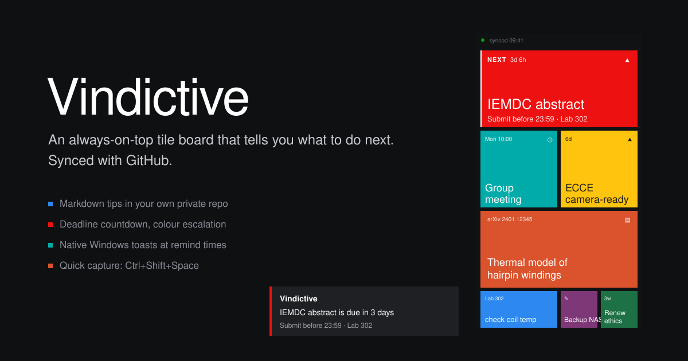
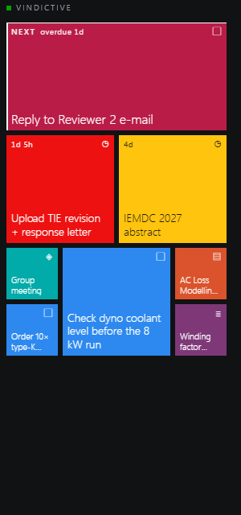
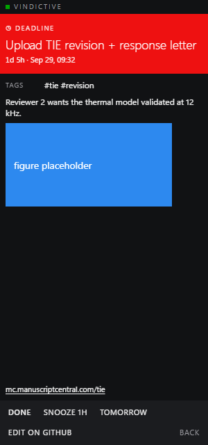
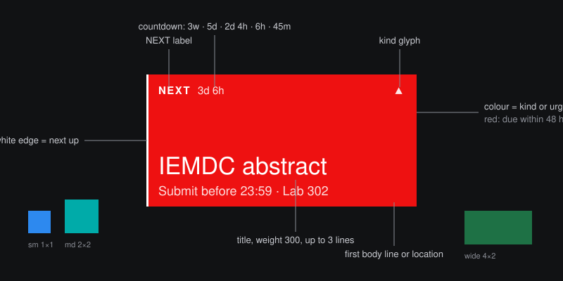

<p align="center">
  
</p>

<h1 align="center">Vindictive</h1>

<p align="center">
  <strong>An always-on-top tile board that tells you what to do next. Tips live in a local folder, synced via OneDrive.</strong>
</p>

<p align="center">
  <a href="https://github.com/Zwl20085/vindictive/actions/workflows/ci.yml"></a>
  <a href="https://github.com/Zwl20085/vindictive/releases/latest"></a>
  <a href="LICENSE"></a>
  
  
</p>

---

## Why

**Deadlines hide in calendars.** A conference abstract due Thursday is one line
among forty. Vindictive puts it on the monitor as a red tile with a countdown,
above every other window, until you press Done.

**Experiments do not wait for your to-do app.** When the thermal chamber is at
temperature you have one hand free. `Ctrl+Shift+Space`, type a line, Enter.
The tip is a Markdown file in your tips folder two seconds later. It syncs to
your other PCs through OneDrive.

**Reading queues rot.** Paste an arXiv id or a DOI and the tile fills itself
with title, authors and year. The queue is a folder of files you can grep,
not a browser tab you will close by accident.

## What it looks like

<p align="center">
  
  &nbsp;&nbsp;&nbsp;&nbsp;
  
</p>

<p align="center">
  
</p>

The two screenshots above are the real board rendered with sample tips (left:
the grid, right: a tile flipped open). The hero image at the top and the
annotated tile are design renders. The board opens at half the work area width
and full height, docked to a screen edge. Everything is flat: one solid colour per tile, zero radius,
no shadows. Titles are set in a heavy serif (an Evangelion title-card nod);
everything else is plain Metro. Tiles and type scale with the window, a clock /
date / weather panel sits on top, and the whole UI is in English or 简体中文.

| Kind / state | Colour |
| ------------ | ------ |
| task | EVA-01 purple `#4A3B6B` |
| event | deep teal `#2C5F58` |
| note | slate `#3A4356` |
| reading | burnt orange `#8C4A22` |
| deadline, more than 7 days | green `#3F6B3A` |
| deadline, within 7 days | amber `#A87B1F` |
| deadline, within 48 hours | EVA-02 red `#9E2F2A` |
| overdue | crimson `#6E1B2B` |

## Features

- **Half the desktop.** A frameless board of Windows 8 style live tiles that
  opens at half the work area width, full height, docked to a screen edge.
  By default it sits beneath every window like a desktop widget (**Always on
  bottom**), at 50 % background opacity, and starts with Windows. Drag it by
  its 20 px strip, dock it left or right, or tick **Always on top** in
  Settings to keep it above every window instead.
- **One thing is next.** Exactly one tile gets the orange edge and the `NEXT`
  chip. The choice is a fixed, explainable score, not a feed.
- **Deadline countdown.** `3w`, `5d`, `2d 4h`, `45m`, `overdue 2h`. Colour
  escalates green → amber → red → crimson as the date closes in. Countdowns,
  dates and every label are also available in Chinese.
- **Native toasts.** Windows notifications fire at the remind times you wrote
  in the file, once, and when a new tip shows up in the tips folder from
  another PC.
- **Local Markdown files.** Each tip is a `.md` file with YAML frontmatter in
  your tips folder. Edit it in Obsidian, VS Code, or any editor; the app
  rescans every few seconds and updates the board.
- **Quick capture.** Global hotkey `Ctrl+Shift+Space` opens a one-line bar:
  `Check coil temp after run 3 #lab !high @tomorrow 09:30 ^"Lab 302"`.
- **arXiv and DOI auto-fill.** `arxiv: 2401.12345` or `doi: 10.1109/...` in a
  tip fetches title, authors, year and venue into the file.
- **Recurring tips.** `repeat: weekly on mon at 10:00`. Pressing Done rolls the
  tip forward instead of closing it.
- **Tray icon, autostart, dark and light themes.**
- **Private by default.** Tips never leave your PC except via your own OneDrive
  (or any sync tool you choose). No tokens, no GitHub account needed.

## Quick start

### 1. Install

Grab the latest `Vindictive_x.y.z_x64-setup.exe` (per-user, no admin) or
`.msi` from [Releases](https://github.com/Zwl20085/vindictive/releases/latest)
and run it. Windows 10 21H2 or later with WebView2 (built into Windows 11).

The installer is not code-signed yet, so Windows SmartScreen may say
*Windows protected your PC*. Click **More info → Run anyway**.

**Updating.** From 0.3.0 on, right-click the tray icon → **Check for
updates…**. Vindictive downloads the newest signed installer from Releases,
installs it and restarts. Copies older than 0.3.0 need one manual install of
the new `setup.exe`.

### 2. Your tips folder (automatic)

On first launch Vindictive picks a tips folder automatically:
- If OneDrive is installed: `%OneDrive%\Vindictive`
- Otherwise: `Documents\Vindictive`

The folder is created if it doesn't exist. OneDrive keeps it in sync between
every PC signed in to the same account; any other sync tool (Dropbox,
Syncthing, a NAS share) works too, because the app only reads and writes files.

To use a different folder, open Settings and change the path under **Tips
folder**. To migrate from the GitHub version (0.2.x), copy the files from your
old repo's `tips/` directory into the new tips folder. Details:
[docs/SETUP.md](docs/SETUP.md).

### Try it without installing anything

The frontend runs in a plain browser against an in-memory backend with sample
tips, so you can see the board before you install Rust or create a repo:

```sh
git clone https://github.com/Zwl20085/vindictive.git
cd vindictive
npm install
npm run dev            # open http://localhost:1420
```

### Build from source

Prerequisites:

- [Rust stable](https://rustup.rs) (1.80 or later)
- [Microsoft C++ Build Tools](https://visualstudio.microsoft.com/visual-cpp-build-tools/)
  with the *Desktop development with C++* workload (the Rust MSVC toolchain
  needs its linker)
- Node 18 or later
- [WebView2 runtime](https://developer.microsoft.com/microsoft-edge/webview2/)
  (already present on Windows 11)

```sh
npm install
npm start              # the real app with hot reload (same as npm run tauri dev)
npm run tauri build    # installers in src-tauri/target/release/bundle/
```

The first Rust build compiles every dependency and takes a few minutes; later
builds are incremental.

## Tip format

One file per tip. Only `title` is required; unknown keys are preserved.

```markdown
---
title: Submit ECCE camera-ready
kind: deadline
priority: high
due: 2026-10-15
remind: [-1w, -1d, -2h]
location: Lab 302, bench 4
links:
  - https://ecce.org/authors
images:
  - figures/coil-thermal.png
tags: [ecce, paper]
---

- [ ] regenerate Fig. 4 with the 12 kHz data
- [ ] update author ORCID
```

| Key | Values | Notes |
| --- | ------ | ----- |
| `title` | text | required |
| `kind` | `task` `deadline` `note` `reading` `event` | default `task` |
| `priority` | `low` `normal` `high` | tile size and score |
| `status` | `open` `done` | written by the app |
| `due` | `2026-10-15` or `2026-10-15 17:00` | bare date means 23:59 |
| `remind` | list of `-30m` `-2h` `-1d` `-1w` or absolute times | relative to `due` |
| `location` | text | shown on the tile and in detail |
| `links`, `images`, `tags` | lists | images relative to the tips folder |
| `repeat` | recurrence rule, see below | Done rolls `due` forward |
| `color` | any CSS colour | overrides the kind colour |
| `arxiv`, `doi` | id | fills the `paper` block |
| `paper`, `snoozed_until`, `done_at`, `created` | | written by the app |

Full reference: [docs/TIP-FORMAT.md](docs/TIP-FORMAT.md).

### Quick-capture syntax

| Token | Meaning |
| ----- | ------- |
| `#tag` | add a tag, repeatable |
| `!high` `!low` | priority |
| `@today` `@tomorrow` `@nextweek` `@2026-10-15` | due date, 23:59 unless `HH:MM` follows |
| `^location` | location, quote for spaces: `^"Lab 302"` |
| `>task` `>deadline` `>note` `>reading` `>event` | kind |
| arXiv id, arXiv URL, DOI | becomes a reading tip and fetches metadata |

### Recurrence grammar

```
daily [at HH:MM]
weekdays [at HH:MM]
weekly on mon[,thu] [at HH:MM]        every monday [at HH:MM]
monthly on 15 [at HH:MM]
yearly on 03-15 [at HH:MM]
```

Default time is 09:00. Months without the requested day are skipped.

### How "next up" is chosen

Every open, un-snoozed tip gets a score. The highest wins; ties go to the
earlier due date, then the title.

| Component | Points |
| --------- | ------ |
| overdue | 1000 |
| due within 48 h | 500 |
| due within 7 days | 200 |
| due later | 50 |
| no due date | 10 |
| priority high / normal / low | +30 / +10 / +0 |
| kind deadline / event / task / reading / note | +5 / +3 / +2 / +1 / +0 |

An overdue low-priority note therefore outranks a high-priority task due next
month. That is on purpose: the board exists to make the overdue thing
impossible to ignore.

## Architecture

```
vindictive/
├── src/                 web frontend, vanilla TypeScript + Vite
│   ├── types.ts         IPC contract shared with the backend
│   └── ...              tiles, detail view, settings, capture bar
├── src-tauri/src/
│   ├── core/            pure domain logic, no I/O, unit-tested
│   │   ├── tip.rs       Tip model, frontmatter round trip
│   │   ├── recur.rs     recurrence grammar
│   │   ├── nextup.rs    scoring
│   │   ├── deadline.rs  urgency levels
│   │   └── capture.rs   quick-capture parser
│   ├── sync/            folder watcher, arXiv, Crossref, Open-Meteo
│   └── app/             Tauri state, commands, scheduler, tray, windows
├── docs/                DESIGN.md, TIP-FORMAT.md, SETUP.md
└── examples/tips/       starter tips for your tips folder
```

The backend owns the truth. Every mutation is a command that returns the new
board state and emits `board-updated`, so the board and the capture bar never
disagree.

## Roadmap

- [ ] Linux and macOS builds (Tauri makes this mostly a CI matrix change)
- [ ] GitHub Issues as an alternative backend
- [ ] Obsidian plugin that mirrors the tile board in a side pane
- [ ] Calendar `.ics` export of deadlines and events
- [ ] Per-monitor docking and multi-board profiles

## Contributing

Issues and pull requests are welcome. See [CONTRIBUTING.md](CONTRIBUTING.md):
conventional commits, tests first, and the same commands CI runs.

## License

[MIT](LICENSE) © 2026 Wentao Zhang
